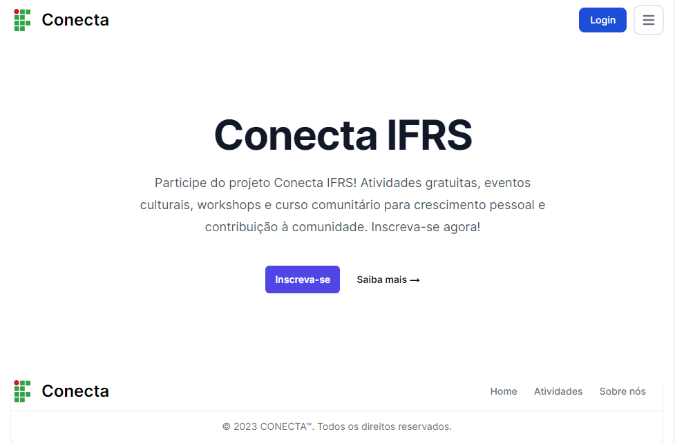

# TrabalhoFinalProg3



> Este projeto consiste em uma aplicação full stack que utiliza uma REST API e banco de dados SQL para a gestão de dados. A aplicação web correspondente foi desenvolvida com Next.js e Tailwind.

### Ajustes e melhorias

O projeto já foi finalizado, mas necessita de algumas atualizações que serão voltadas nas seguintes tarefas:

- [x] Alterar senha
- [ ] Paginação
- [ ] Status dos usuários
- [ ] Adicionar componente Spinner

## 💻 Pré-requisitos

Antes de começar, verifique se você atendeu aos seguintes requisitos:

* Você deve possui o XAMPP e o NodeJS em sua maquina.

## 🚀 Instalando o projeto

Para instalar o projeto, siga estas etapas:

```
git clone https://github.com/CristianoLedur/TrabalhoFinalProg3.git
```


## ☕ Usando o projeto

Para começar a utilizar este projeto, siga estas etapas:

### Frontend

1. Abra um terminal e navegue até a pasta do cliente:
```
cd client
```

2. Instale as dependências do cliente:
```
npm install

npm update
```

3. Inicie a aplicação do cliente:
```
npm run dev
```

### Backend
1. Certifique-se de ter o Apache e o MySQL do XAMPP inicializados.
2. Abra outro terminal e navegue até a pasta do servidor:
```
cd server
```

3. Instale as dependências do servidor:
```
npm install
```

4. Inicie o servidor:
```
node src/server.js
```

Agora, você está pronto para começar a usar o projeto com o frontend e o backend configurados adequadamente.

## 📝 Licença

Esse projeto está sob licença. Veja o arquivo [LICENÇA](LICENSE.md) para mais detalhes.

[⬆ Voltar ao topo](#TrabalhoFinalProg3)<br>
